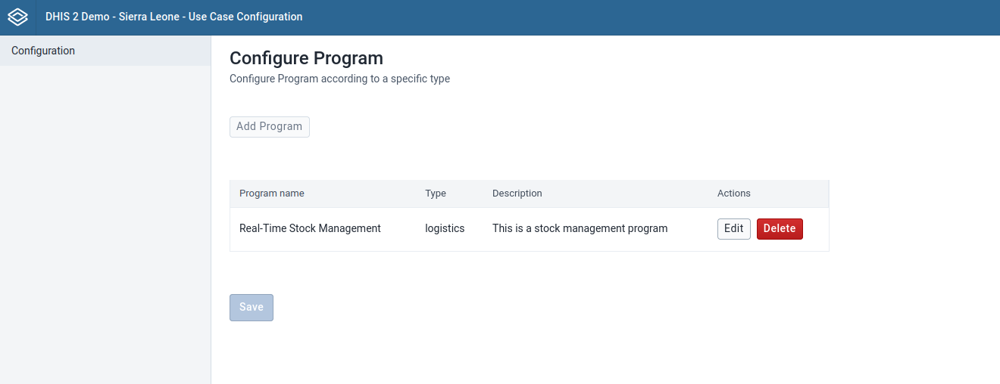
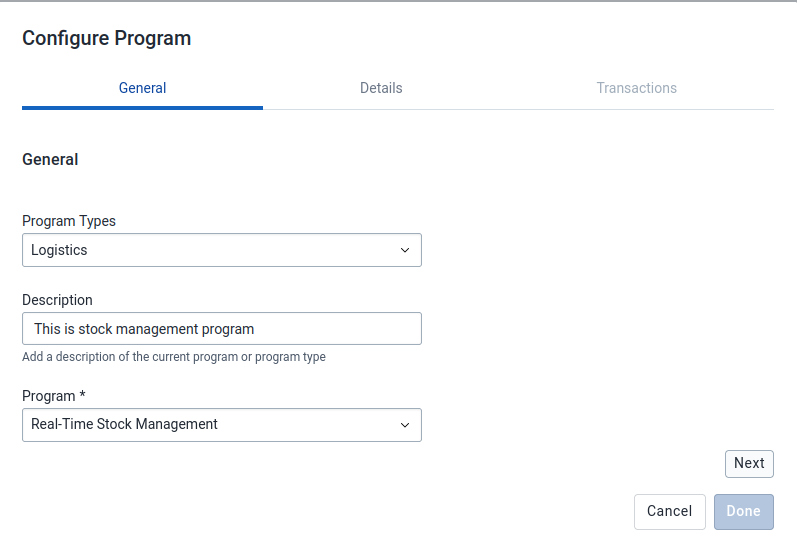
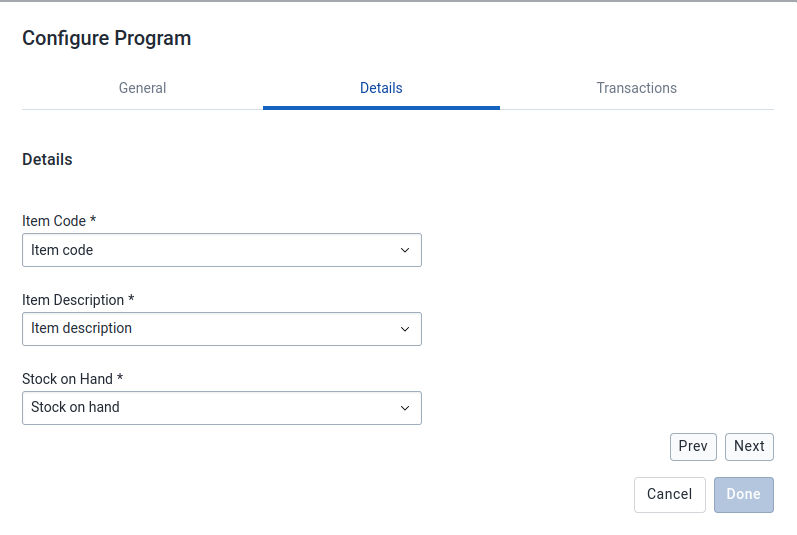
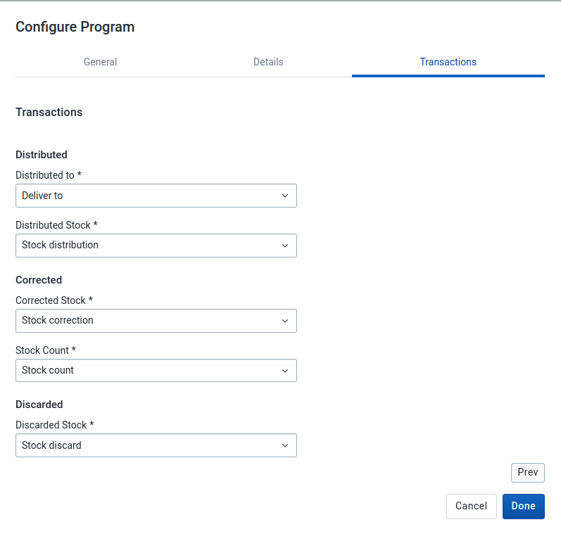
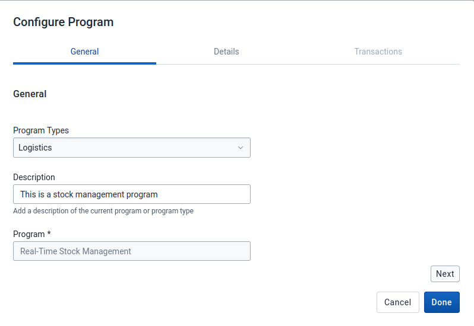
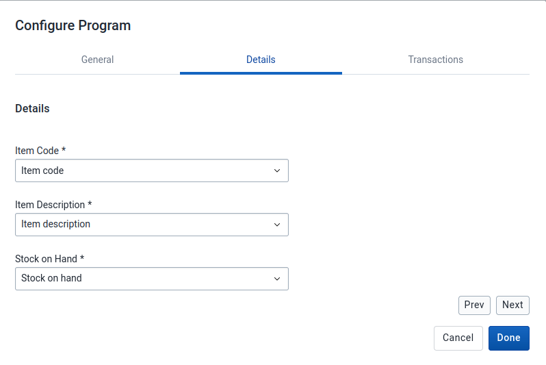
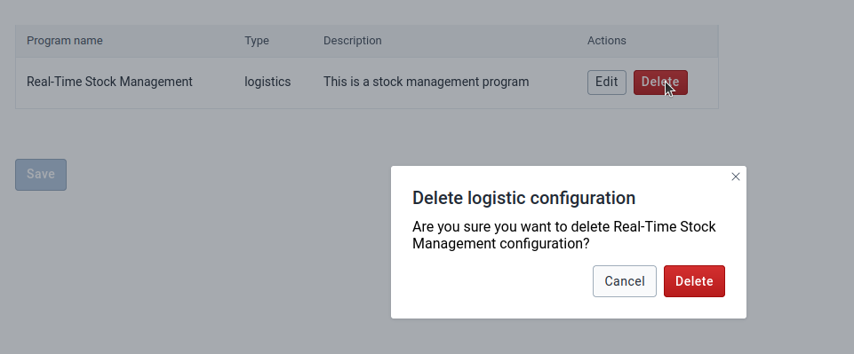
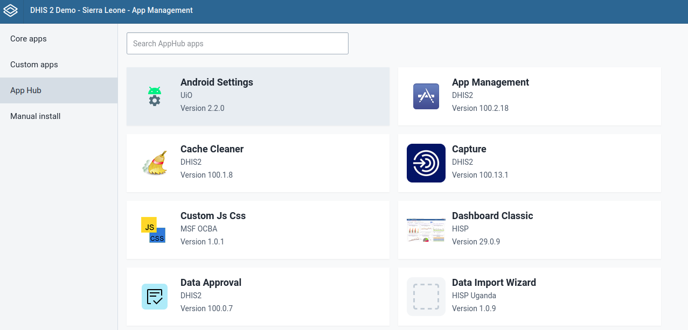
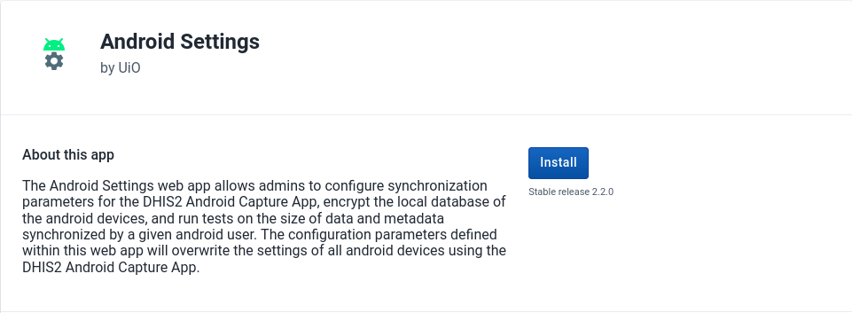
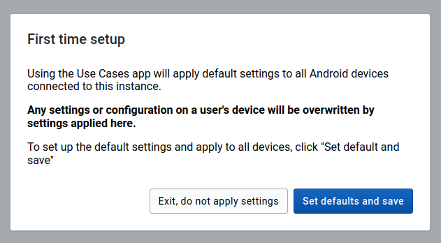

# Use Case Configuration Web App { #capture_app_use_case_configuration_webapp }
## Overview { #capture_app_use_case_configuration_webapp_overview }

This section focuses on the [Use Case Configuration Web App](https://apps.dhis2.org/app/) implementation.

The [Use Case Configuration Web App](https://apps.dhis2.org/app) will connect the components of use cases, like Pharmacy stock management (LMIS), such as the Tracker Program and Data elements, to the Android Capture App. This app ensures configuration flexibility and avoids hard coding various metadata in the actual mobile application.

Based on the configuration, any program of the DHIS2 server can be set as a stock management system or any other use case.

Please note that in this version of the Web App, only users with "ALL" authority are able to define the configuration. Other users will not have access to the web app or see the configuration.

> **Warning**
>
> Be aware that the app can only be used in instances using the 2.39.1 DHIS2 API version onward.
> 
> 
>

## Configure Program { #capture_app_use_case_configuraton_webapp_configure }

It allows admin users to configure programs to use the stock management system use case.

### Create configuration

The DHIS2 Use Case Configuration App assigns the use case, like Real Time Stock Management, to any Tracker Program.
When the user opens the application in the Android Capture app the DHIS2 RTS is started instead of a conventional Tracker Program.

To create a **Program Configuration**:

1. Select a program type, a program, and add a description.
2. Click on *Next* button or *Details* tab.

3. Select the tracked entity attributes and data elements that represent Item code, Item Description and Stock on Hand. You have then to click on *Next* button or *Transactions* Tab.

4. Choose the data element/tracked entity attribute that will represent the Distributed Transaction.
5. Choose the data element/tracked entity attribute that will represent the Corrected Transaction.
6. Choose the data element/tracked entity attribute that will represent the Discarded Transaction.
7. Click on the "Done" button.

> **Note:**
>
> When all the valid programs are already configured, the Add Program button will be disabled.
>
> 
>
> The compatible and supported programs for a RTSM use case are:
> - Tracker program with one repeatable program stage.
> - Program rules to provide the real time stock on hand update.
> - Data elements and Tracker Entity Attributes assign to program and program stage.
>

### Edit configuration

To edit a **Program Configuration**:

1. Search for the program configuration to edit.
2. Click the "Edit" button next to the program's name.
3. A pop-up with only the description field in the General tab will be available, the other fields will be disabled. If wanted, change the visualization title.
4. All fields in Details and Transactions tabs will be available to edit if needed.
5. Click on the "Done" button.

### Delete configuration

To remove a **Program Configuration**:

1. Search for the program configuration to delete.
2. Click on "Delete".
3. Click on the "Delete" button.

## Installation { #capture_app_use_case_configuration_webapp_installation }

A user can easily install the Use Case Configuration Web App by logging into the DHIS2 and going to **App Management**.

- Click on **App Hub**
- Go to *Use Case Configuration App*
- Click on *Install V1.X.X*

[//]: # (TODO: change img)

## Log in and first time setup { #capture_app_use_case_configuration_webapp_login }

After a user installs and launches the Use Case Configuration Web App for the first time, the web app will require saving the default values of the configuration. This will allow android devices connect to the instance.

{width=50%}

> **Warning**
>
> Only users with 'ALL' authority are able to *save or update* the configuration, users with no authority will not have view access to the app even if it is already created.
>

{width=50%}

## Enter and save configuration parameters { #capture_app_use_case_configuration_webapp_enter_and_save }

### Datastore { #capture_app_use_case_configuration_webapp_datastore }

Internally all program configurations are stored in [Datastore](https://docs.dhis2.org/en/develop/using-the-api/dhis-core-version-240/data-store.html) in JSON format.

Datastore structure:

| Item      | Description                                 | Data type |
|-----------|---------------------------------------------|-----------|
| Namespace | Namespace for organization of entries       | String    |
| Key       | Key for identification of values            | String    |
| Value     | Value holding the information for the entry | JSON      |

### Save configuration parameters { #capture_app_use_case_configuration_webapp_save_config }

At the footer of the configuration section, admin users can find a *Save* button.

Only when an admin user clicks on this button, all changes made are saved on the Datastore. These changes will apply to the Android Capture Apps when they synchronize their configuration.
